# 1.概要设计
## 算法模块
* **目标检测算法**：使用了轻量，快速,可适用于移动端的的mobilenet_SSD神经网络框架，该框架使用PASCAL VOC数据集训练，并最终得到可识别20种常见物体，实现目标分类并回归其的边界框caffe model.

* **目标追踪算法**：利用回归的边界框记录物体的质心，在假设同一物体在相邻帧的质心距离最近的前提下，更新每一帧所检测到的边界框，用当前质心替换掉与之相距最近的质心，并赋予一个ID,从而实现了视频流的目标追踪。

* **目标定位及测速算法**：基于**图像像素距离与空间距离变换公式**,首先标定相机离目标的垂直距离，以及相机偏移角者两个参数，再通过将目标追踪算法实时更新得到的的目标质心坐标带入上述论文里的图像像素距离与空间距离变换公式中，可根据图像的质心像素点求得目标的实际位置点，从而实现实时定位，算法可实时输出目标的方向角和与相机的相对位置。同理，算法缓存了每个目标的所有质心历史记录，从而通过两帧画面测得的实物移动距离，除以这两帧相隔的帧数时间，再加上相机的移动速度，从而实时监测目标的移动的绝对速度。

## 软件模块
* **用到的第三方模块**：opencv,numpy,scipy，目标检测算法的实现通过opencv dnn模块，追踪，定位及测速使用到的是numpy和scipy。
* **mytrakcer.py**:该模块编写了一个类AI_Tracker,为该类编写了能够实现目标质心，目标质心历史记录缓存，目标边界框，以及目标位置，速度的实时更新的方法，并能实时注销掉设定的超过最大帧数未出现的目标，实现目标的实时追踪。

* **video_recognition.py**:该模块为主程序，通过该程序，能过实现对选定目标的分类，追踪，定位，测速，并实现可视化。该模块使用了opencv的dnn模块，该模块能部署训练好的caffe神经网络模型，从而实现后续的追踪，识别，定位功能。

           

# 2.详细设计
* **目标检测算法**：MobilenetSSD
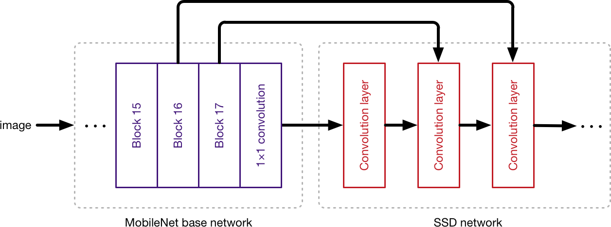

输入图片数据，将输出图片中的物体的类别，置信概率，并回归物体的边界框
* **目标追踪算法**：centroid tracker（质心追踪器）
* **step1**:接受边界框坐标并计算质心

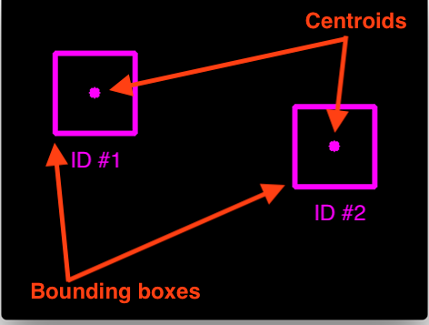

* **step2**:计算新边界框与当前对象之间的欧式距离

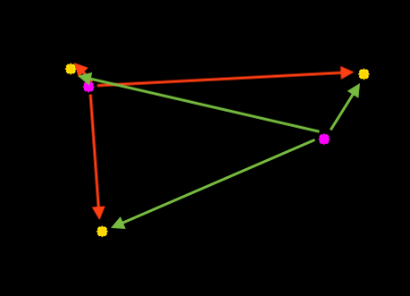

* **step3**:更新当前对象的质心坐标(x,y)

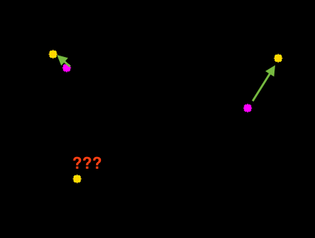

* **step4**:注册新的对象

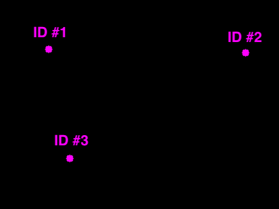

* **目标定位及测速算法**：图像像素距离与空间距离变换公式

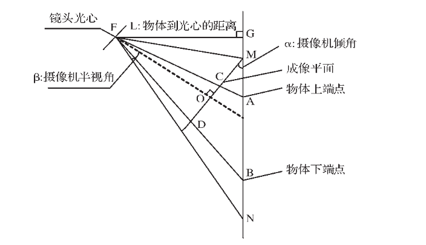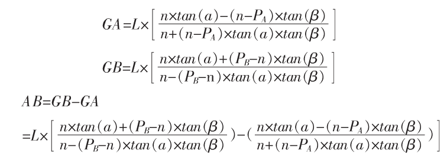
PA,PB分别为实物场景中的A,B点所对应的像素点位置坐标，这里取一维坐标X,即图片的横轴，2n为X轴的总像素点，由于我处理的视频图片宽度裁剪成了400,则n取200,参数beta角为相机的最大视场角，设为标准视场，为53度;则上述方程式剩下两个变量L和alpha,L为摄像头光心到物体的垂直距离，alpha为摄像头偏转角，为了求解这个二元非线性方程，需要构建一个方程组。
* 以小汽车为例子，阐述整个测速及定位过程：

首先小汽车的长度有一个经验值，取值为3米，假设我们的目标对象为Id为4的car,截取两帧包含ID:4的图片，我们拥有了两个边界框，即car的前后端点的像素点位置，通过这两帧的图片构建了一个二元非线性程组，即可求出该对像L和alpha参数，再带入上图公式求出实物距离AB，从而完成了由像素点距离到实物距离的映射，同理应用于任何一个选取的对象，由上图的几何关系，可求出FB的长度以及FB偏离光轴线的长度，即物体到摄像头的距离和偏移角，从而在已知摄像头位置的情况下，实现物体的恶实时定位；选取间隔一定帧数的两帧图，由质心点的像素距离，求出实物质心移动距离，再除以帧数间隔时间，即可求得实物相对摄像头的相对速度，已知摄像头速度的情况下，可求得物体绝对速度（实际效果见测试报告部分）

# 2.测试报告
* **实时目标检测，定位，检测**

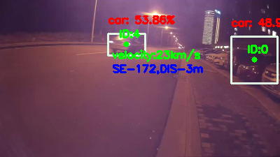
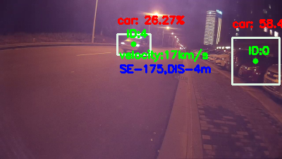
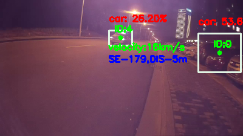

**监测视频文件**：720P-60文件夹下2048001文件，该文件描述为（摄像机位置：北纬33°57′55″ 东经118°15′3″；摄像机方向：东南138度；摄像机速度0km/h），从中截取了连续片段中的三帧图片；

**监测结果**:出选定的目标(ID:4)为汽车，实现边界框回归，实时速度分别为23，17,16km/h,实时位置分别为为东南172,175,179度，分别距离摄像头3,4,5m。    监测结果与实际情况比较相符。

* **实时轨迹标记**

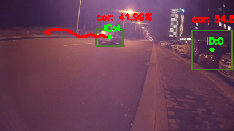

* **动态小目标，多目标检测**

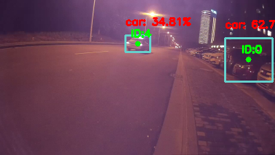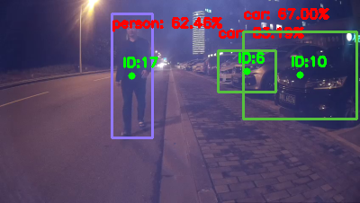

* **搜索指定目标出现帧数**

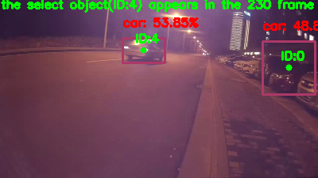

* **注意事项**：
在定位与测速的时候，如何选取两帧的间隔帧数，有一定的限制，由于在求解非线性方程的时候，通过可视化，发现该非线性函数在取值区间的梯度很小，由于目标检测算法回归的边界框存在误差，会导致参数的数值解极其不稳定，我在求解过程中尝试了多种可能性，选取了间隔20帧，能获得一个比较稳定的结果。
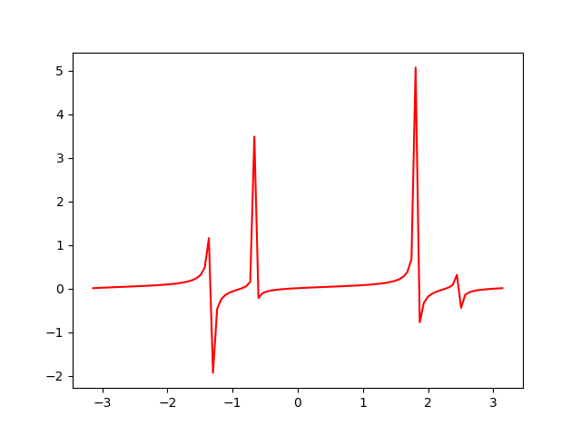

* **运行速度测试**
* *测试设备*:thinkpad E460,
* *处理器*：Intel® Core™ i5-6200U CPU @ 2.30GHz × 4
* *视频处理速度*：14.36 FPS 
